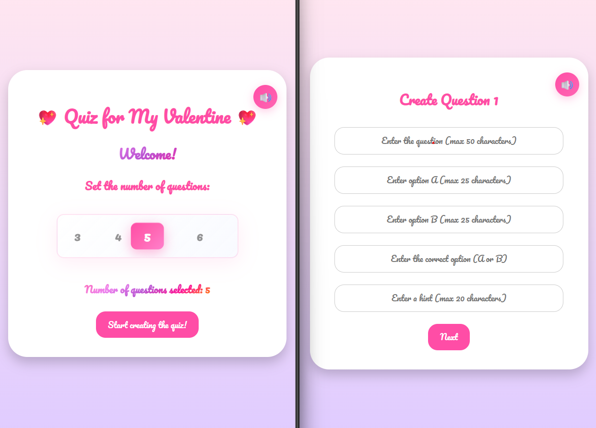
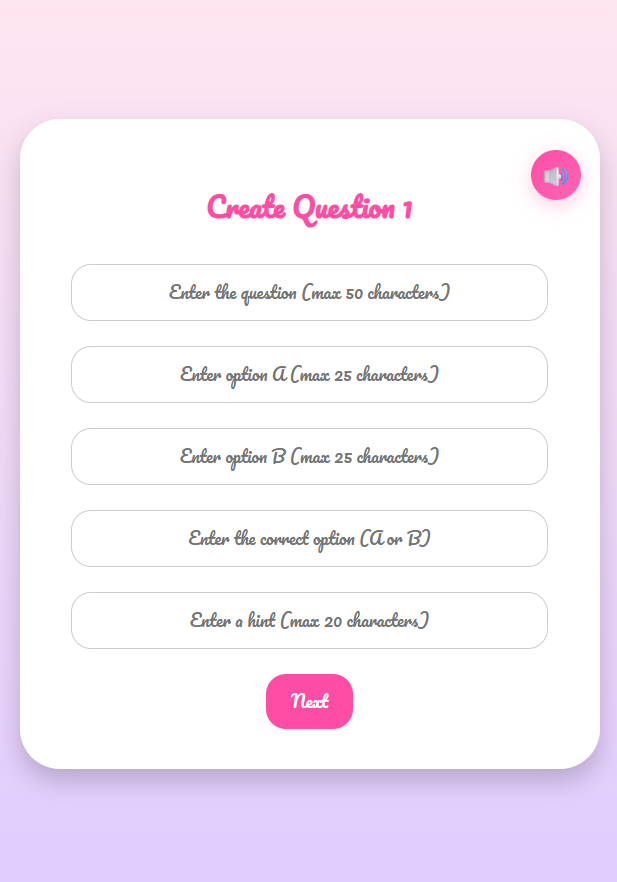

# Quiz for My Valentine

A simple and sweet quiz game for couples.

## Features
- Generate 1-25 questions with a cool spinner
- Animated question cards
- Couple Analysis
- Sound effects

## Technologies
- Vanilla JavaScript
- HTML5 / CSS3
- Web Audio API

## How to Play?
- Select 1-25 questions using the spinner on the opening screen.
- Start creating the same number of questions as you selected.
- Enter your options for the questions and select the correct answer.
- Enter hints for the questions to help your partner. ☻
- When you're ready, you can start solving the test with your partner!
- You earn +1 point for each correct answer. You don't lose anything for an incorrect answer.
- When the test is over, you can see your score and your compatibility with your partner with the "Compatibility Analysis" card!
- You can start creating the test again with the "Play Again" button.
- You can control the sound at any time with the sound on/off button at the top right of the screen.
- Also, the sweet and romantic animations that continue throughout the game will increase your fun!
- HAVE FUN! ♥

<table>
  <tr>
    <td></td>
  </tr>
  <tr>
  </tr>
</table>
<table>
  <tr>
    <td></td>
  </tr>
  <tr>
  </tr>
</table>

