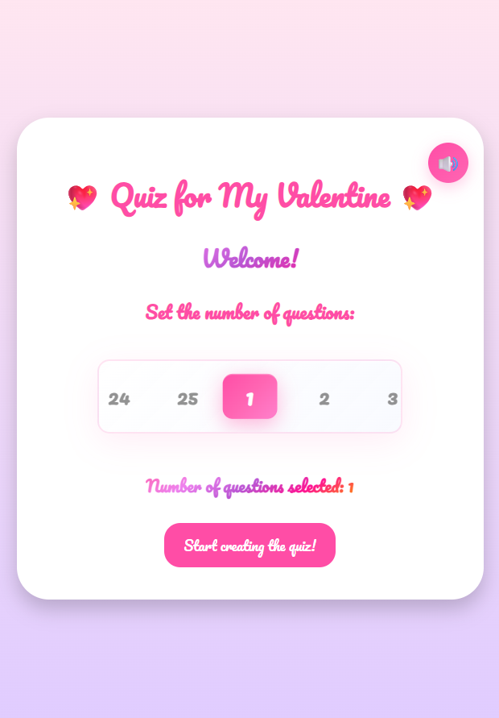

# Quiz-for-My-Valentine-EN
A sweet and romantic web-based quiz game for couples.

🔗 **Create your first test!:** https://semihalp.github.io/Quiz-for-My-Valentine-EN/

## Features
- Generate 1-25 questions with a cool spinner
- Sharing via WhatsApp/URL
- Animated question cards
- Couple compatibility analysis
- Emojis and sound effects

## Technologies
- Vanilla JavaScript
- HTML5 / CSS3
- Web Audio API
- GitHub Pages

## How to Play?
- Use the spinner on the home screen to select between 1 and 25 questions.
- Start creating your quiz with the number of questions you chose.
- Enter the answer options and define the correct one.
- Add a hint to your questions to help your partner out. ☻
- When you're ready, share the quiz with your partner via WhatsApp or a direct link!
- Your partner earns +1 point for every correct answer. There is no penalty for wrong answers.
- Once finished, your partner will see a "Compatibility Analysis" card showing their score and how well you match. This card can be shared with you via WhatsApp or direct link!
- Your partner can retake the quiz using the "Play Again" button.
- You can view the score on the shared result card, or use the button on the card to create a brand new quiz yourself.
- You can toggle the sound anytime using the button in the top-right corner.
- Plus, enjoy cute and romantic animations throughout the game to double the fun!
- HAVE FUN! ♥

## Gameplay Preview

<table>
  <tr>
    <td></td>
    <td></td>
  </tr>
  <tr>
    <td></td>
    <td></td>    
  </tr>
  <tr>
    <td></td>
    <td></td>
  </tr>
    <tr>
    <td></td>
    <td></td>
  </tr>
  
</table>

# • Logo •

The design of the logo was inspired by the metal band "Bullet for My Valentine".
